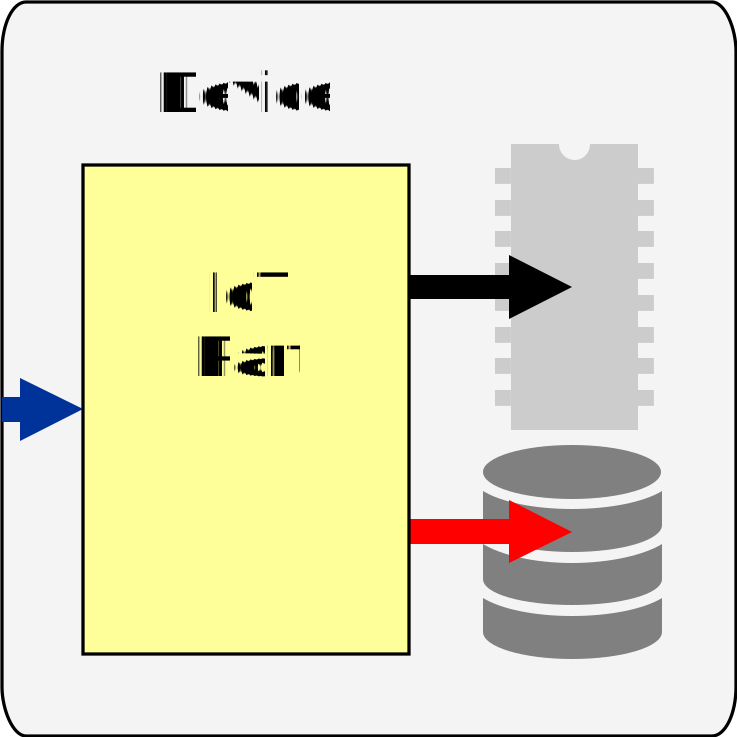
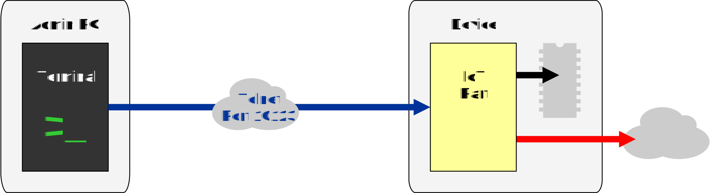
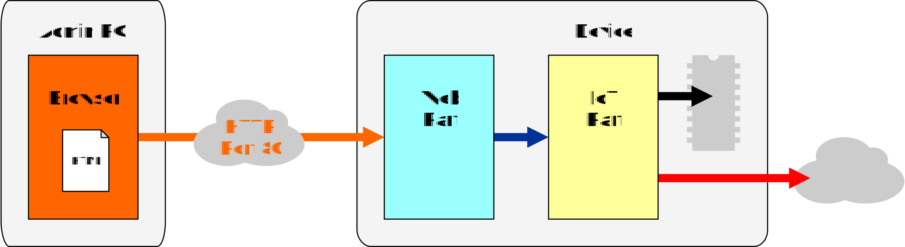
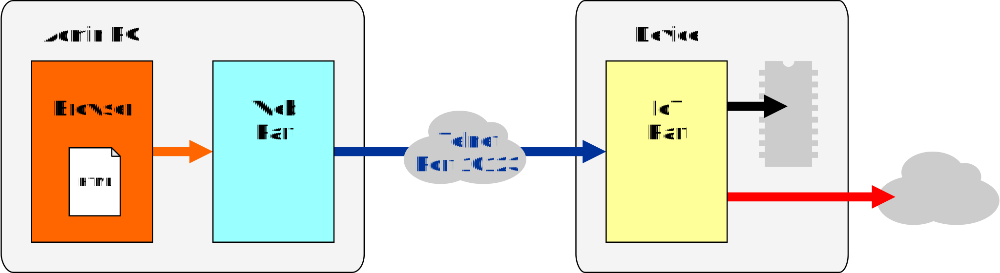
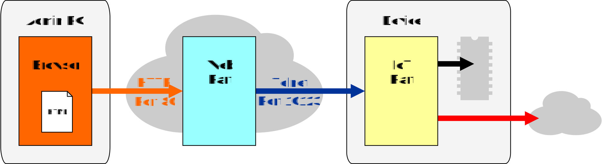
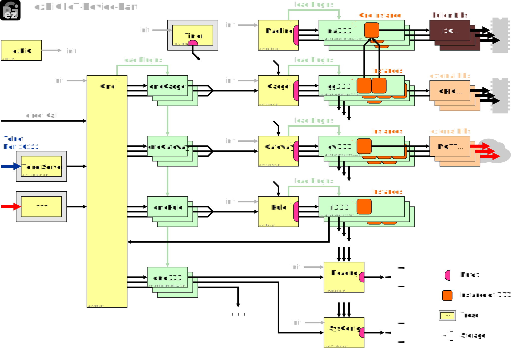
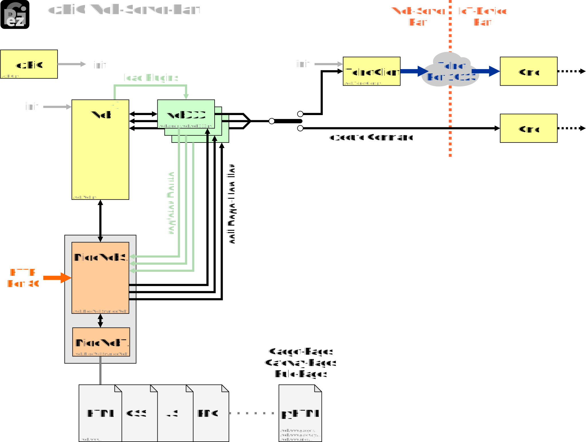

# Splitting in Parts

To fit the requirements of all platforms it is necessary to split the firmware/software in two parts:
* The IoT-device-part to aquire data from the sensors and deliver them to MQTT broker or DB servers in the web
* The web-server-part to provide configuration web pages (HTML). The user can configure IoT-device-part with a browser (FireFox, Chrome, Edge, ...) by clicking web GUI

-------------

# Running the IoT-Device* 

## IoT-Device with web access (e.g. MQTT)

If the IoT-device is already configured no Web-server-part is necessary. The IoT-device-part can aquire data from the connected sensors and deliver them to MQTT broker or DB servers in the web via WiFi.

## IoT-Device as data logger

The IoT-device can also be used as data logger without any web access. Log files can be collected later via USB or Telnet commands.

***

# Configuration the IoT-Device - Communication between Parts

## Simple Device with Telnet Communication only

The IoT-device-part can be configured completely with textual commands via Telnet. To send commands start a terminal program in Telnet or Raw mode and connect to the IoT-device IP address with port 23101.

For more information about commands see [Command-Wiki](../commands/Commands)

Note: Advanced Admin required!

## Device with build-in Web-Server-Part - HTTP GUI

On platforms with more resources (Raspberry Pi, PC) the web-server-part can be included. The user can connect to the IoT-device IP address with a browser (FireFox, Chrome, Edge, ...) and can configure the IoT-device-part by clicking web pages.

## Simple Device with Web-Server-Part on Admin PC - HTTP GUI

The Web-server-part can also started on the user PC. The user can connect to the web-server at local IP address (localhost) with a browser (FireFox, Chrome, Edge, ...). At first the user has to enter the IoT-device IP address in the browser and than can configure the IoT-device-part by clicking web pages.

## Simple Device with Web-Server-Part in the Cloud - HTTP GUI

Same as variant above but with the Web-server-part on an external server in the intranet. Technically it can be a server in the internet but is not recommented.

---

# IoT-Device-Part

For detailed information ask JK

---

# Web-Server-Part

For detailed information ask JK
