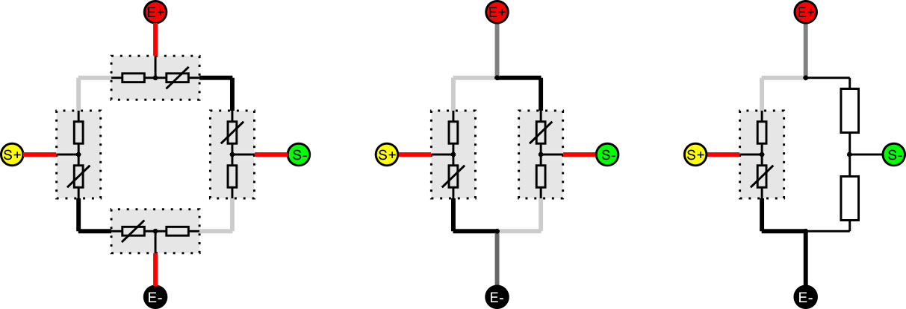
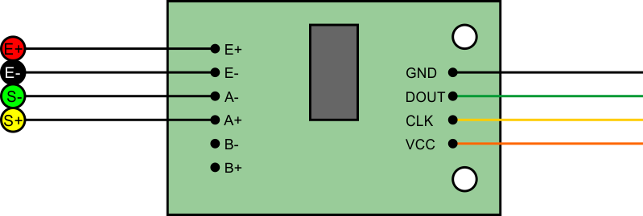

# Gadget Plugin "HX711"

## Description

TODO

## Settings

|Setting|Description|
|:---|:---|
|Gadget Name|TODO
|Enabled|TODO

## Connecting Half-Bridge Sensors

The Sensors have colored cables typically red, black and white. See image for right wirering.

Note: red means **NOT** plus and black means **NOT** minus!

## Connecting the Board

