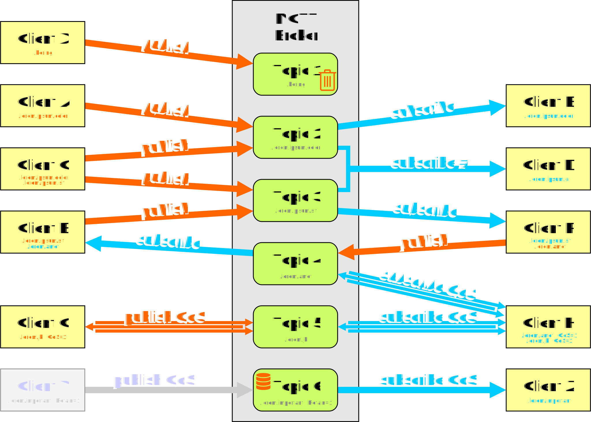
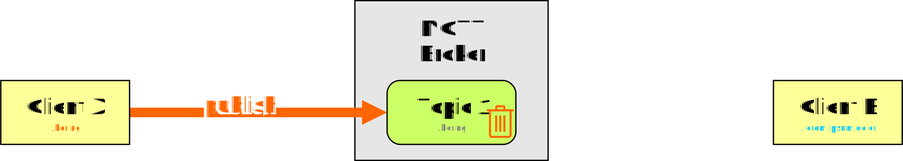
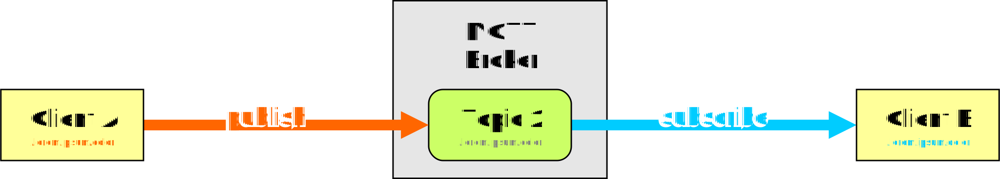
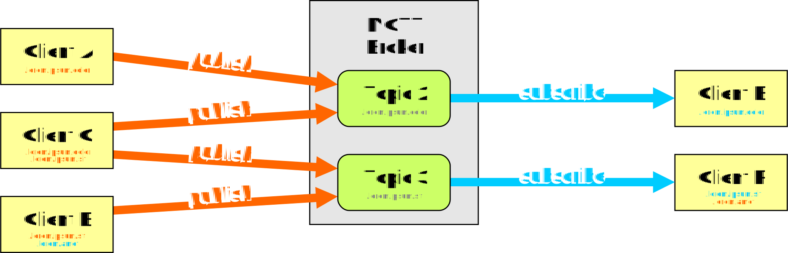
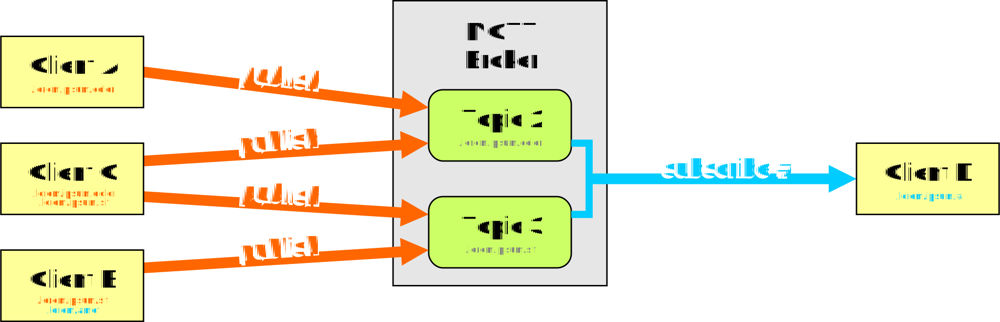
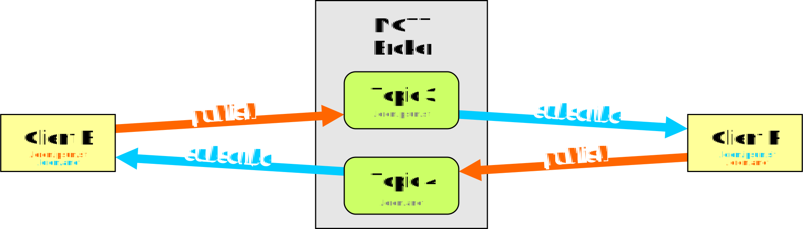
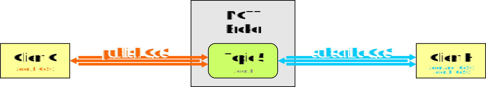
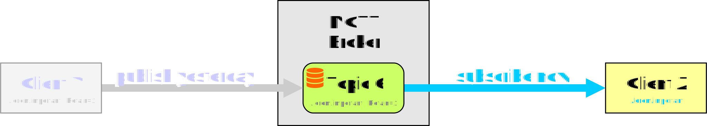

# What is MQTT

... see [Wikipedia](https://en.wikipedia.org/wiki/MQTT)

# MQTT Data Flow by Examples

Based on this image the following examples can show typical data flows

## Example: 1 Publisher, no Subscriber

* Client X connected

If Client X publishes any data with Topic 1 and nobody is listening (nobody has subscribed Topic 1) the data is lost.

(Exception: see Topics with Retain Flag)

## Example: 1 Publisher, 1 Subscriber

* Client A connected
* Client B connected and subscribes Topic 2

If Client A publishes any data with Topic 2 and Client B is notified instantly about change of Topic 2.

# TODO

## Example: Many Publisher, Many Subscriber

* Client A, C, E connected
* Client B connected and subscribes Topic 2
* Client F connected and subscribes Topic 3

Any Client can publish any data with any Topic at anytime. The subscriping Clients are notified instantly about change of the Topics they subscripes and only that.

## Example: Many Publisher, 1 Subscriber with Wildcard

* Client A, C, E connected
* Client D connected and subscribes Topic with '#'

Any Client can publish any data with any Topic at anytime. A Client can subcripe with '+' and/or '#' in the Topic name. The Client is notified instantly about any change of all Topics which matches the wildcard Topic name.

## Example: Request and Answer

* Client E connected and subscribes Topic 4
* Client F connected and subscribes Topic 3

Every Client can be publisher and subscriper. For sneding a request/command one Topic can be used. For the answer an other Topic is used.

Note: This can be solved with only one Tpoic but the publisher would receive his own request/command.

## Example: QoS-Flag - Quality of Service

* Client G connected
* Client H connected and subscribes Topic 5 with QoS

A Client can publish data with any Topic with flag QoS set. This garantees that the data arrives the broker.

A Client can subscripe with flag QoS set. This garantees that the data arrives the clinet.

|QoS|Meaning|
|:---:|:---|
|0|no garantee (default)|
|1|garantee that data arrives|
|2|garantee that data arrives only once|
 
Note: Each publisher and each subscriper can user the QoS flag without affecting the others.

## Example: Remain-Flag

* Client Y was connected long time ago
* Client Z connects now and subscribes Topic 6

__Ages abo:__ A Client publish any data with a Topic and Remain flag set. The broker stores the Topic with data in its own database/file. The publishing Client died...

__Now:__ An other Client ist started and subscripes a Topic. The Client is notified instantly about the stored data of the Topic

|Remain|Meaning|
|:---:|:---|
|0|fire and forget|
|1|saved on broker|

