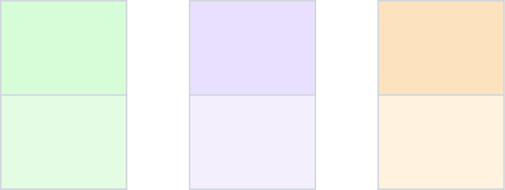

# e&middot;z&middot;Pi&middot;C Styleguide

## Name

In headlines: __e&middot;z&middot;Pi&middot;C__

In text and coding: __ezPiC__

Spelling: [&#716;i&#720;zi &#712;pi&#720;zi] like "Easy Peasy"

## Colors

### Colors for Web-Page

|Color|Typical Usage|
|-|:---|
|`#FFFDE5`|Card BkGnd
|`#FFEEAA`|Text on dark BkGnd
|`#F5980C`|
|`#885511`|
|`#1F1300`|Nav BkGnd, Table Head BkGnd, Form Separator BkGnd 

Example: 

### Colors for Items

#### Main 

|Color|Item|
|-|:---|
|`#F5FFEB`|Gadgets
|`#EBF2FF`|Gateways
|`#FFF3EB`|Rules

#### Pastel

|Color|Item|
|-|:---|
|`#FAFFF5`|Gadgets
|`#F5F8FF`|Gateways
|`#FFF9F5`|Rules

Example: 

## Logo

 
